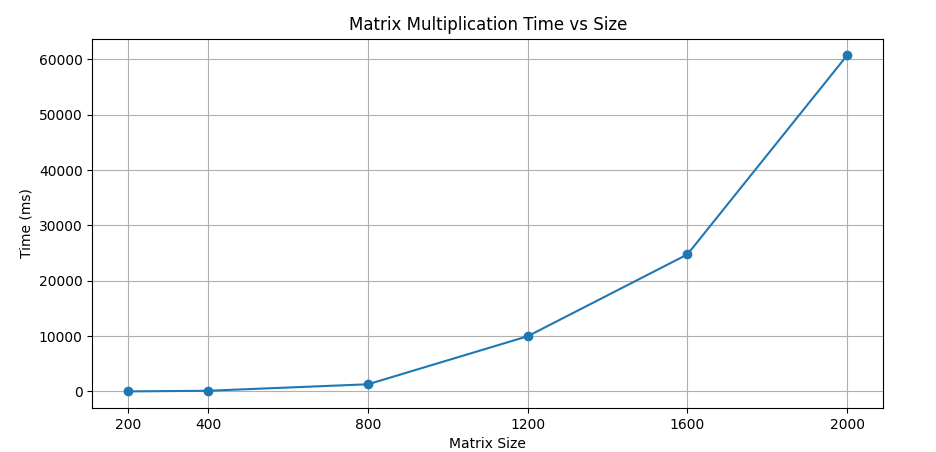

# Параллельное программирование  
## Лабораторная работа №1  
### Программа перемножения двух матриц

**Студент:** Фан Тхе Тинь  
**Группа:** 6213-100503D  

Самара 2026

---

# Цель работы

Реализовать программу перемножения двух квадратных матриц на языке **C++**.

Основные задачи работы:

- Реализовать алгоритм умножения матриц.
- Проверить корректность вычислений с использованием **Python**.
- Измерить время выполнения операции умножения матриц различных размеров.
- Построить график зависимости времени выполнения от размера матрицы.

---

# Структура проекта

Основные файлы проекта:

### 1. `lab_1.cpp`

Основная программа на **C++**.

Функции программы:

- Генерация квадратных матриц размеров:[200, 400, 800, 1200, 1600, 2000]

- Сохранение входных данных в файлы: matrix_size_N.txt

- Выполнение умножения матриц
- Измерение времени выполнения
- Запись результатов в файл timing_results.txt

---

### 2. `main.py`

Python-скрипт для проверки корректности вычислений.

Функции:

- Чтение входных матриц из файлов
- Перемножение матриц с использованием `numpy.dot`
- Сравнение результата с результатом программы C++
- Вывод результата проверки:PASS / FAIL
- Построение графика зависимости времени выполнения от размера матрицы

График сохраняется в файл:graphic_time.png

---

# Результаты экспериментов

Файл результатов:timing_results.txt

Измерения времени выполнения программы проводились для различных размеров квадратных матриц.

### Таблица результатов

| Размер матрицы (n×n) | 200 | 400 | 800 | 1200 | 1600 | 2000 |
|----------------------|-----|-----|-----|------|------|------|
| Non-OMP | 15.4395 | 131.141 | 1302.56 | 9981.56 | 24767.4 | 60732.6 |

Он содержит время выполнения умножения матриц для различных размеров.

На основе этих данных был построен график.

**Рисунок 1 – График зависимости времени перемножения матриц от их размера.**

---

# Вывод

В ходе лабораторной работы была реализована программа умножения квадратных матриц на языке **C++**.

Корректность вычислений была проверена с использованием **Python** и библиотеки **NumPy**.

Проведены эксперименты для матриц различных размеров.

Полученный график показывает, что время выполнения операции увеличивается при увеличении размера матриц, что соответствует вычислительной сложности алгоритма умножения матриц.

