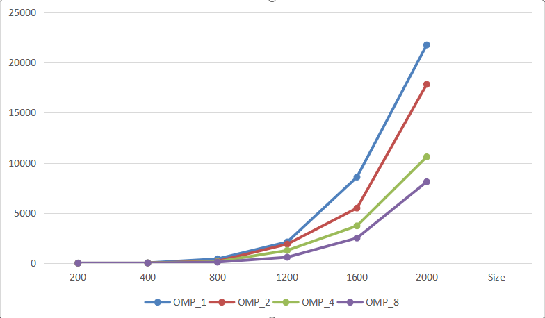

# Параллельное программирование  
## Лабораторная работа №2 
### Программа перемножения двух матриц с использованием технологии **OpenMP**.

# 1. Задание

Модифицировать программу из лабораторной работы №1 для параллельной работы с использованием технологии **OpenMP**.

Провести серию экспериментов с различным количеством потоков: 1, 2, 4, 8 и с различными размерами матриц: 200, 400, 800, 1200, 1600, 2000

Для каждого эксперимента необходимо:

- измерить время выполнения программы;
- сохранить результаты вычислений в файл;
- записать статистику времени выполнения;
- проанализировать полученные результаты.

---

# 2. Описание программы

Основная программа реализована на языке **C++** в файле: lab_2.cpp

Программа выполняет следующие этапы:

1. Генерация двух квадратных матриц размера **N × N**.
2. Сохранение сгенерированных матриц в файл: matrix_size_N.txt
3. Считывание матриц из файла.
4. Умножение матриц стандартным алгоритмом.
5. Параллелизация вычислений с использованием **OpenMP**.
6. Измерение времени выполнения программы.
7. Сохранение результатов умножения в файлы: result_size_N_threads_T.txt

где  
`N` — размер матрицы,  
`T` — количество потоков.

8. Сохранение статистики времени выполнения в файл: timing_results_all.csv

Параллелизация реализована с помощью директивы OpenMP:

#pragma omp parallel for num_threads(num_thread)

Данная директива позволяет распределить вычисления между несколькими потоками процессора и ускорить выполнение программы.

# 3. Результаты экспериментов

В ходе экспериментов была измерена скорость умножения квадратных матриц различных размеров с использованием технологии **OpenMP**.

Эксперименты проводились для следующих размеров матриц:

200, 400, 800, 1200, 1600, 2000

Количество потоков:

1, 2, 4, 8

Измерялось время выполнения операции умножения матриц в миллисекундах.

---

## Таблица результатов

| Size | OMP 1 | OMP 2 | OMP 4 | OMP 8 |
|-----|------|------|------|------|
| 200 | 4.2699 | 2.39 | 1.3025 | 1.4823 |
| 400 | 32.9067 | 20.5563 | 17.0014 | 10.3696 |
| 800 | 422.188 | 192.723 | 143.432 | 97.6454 |
| 1200 | 2104.78 | 1887.24 | 1264.49 | 586.035 |
| 1600 | 8579.88 | 5486.34 | 3716.03 | 2499.6 |
| 2000 | 21766.9 | 17835.3 | 10597.4 | 8109.82 |

Из таблицы видно, что при увеличении количества потоков время выполнения уменьшается.

---

## График зависимости времени выполнения

Ниже представлен график зависимости времени выполнения умножения матриц от размера матрицы при различном количестве потоков.

Рисунок – Зависимость времени выполнения умножения матриц от размера матрицы при различном количестве потоков.

---

# 4. Анализ результатов

Из полученных результатов можно сделать следующие выводы:

- Время выполнения значительно увеличивается при увеличении размера матрицы.
- Это соответствует теоретической сложности алгоритма умножения матриц **O(N³)**.
- Использование **OpenMP** позволяет ускорить вычисления за счёт параллельного выполнения.
- При увеличении количества потоков наблюдается уменьшение времени выполнения программы.
- На больших размерах матриц преимущество параллельных вычислений становится более заметным.

---

# 5. Вывод

В ходе лабораторной работы была реализована программа параллельного умножения матриц с использованием технологии **OpenMP**.

Были проведены эксперименты с различными размерами матриц и количеством потоков. Полученные результаты показали, что использование параллельных вычислений позволяет значительно сократить время выполнения программы.