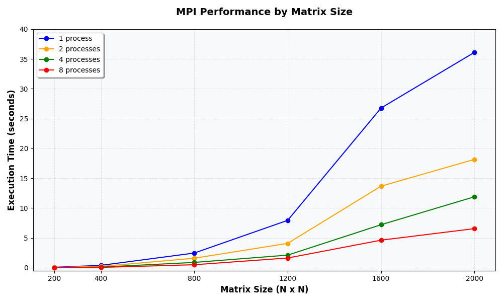

# Параллельное программирование  
## Лабораторная работа №2 
### Программа перемножения двух матриц с использованием технологии **MPI**.

# 1. Задание

Модифицировать программу из лабораторной работы №1 для параллельной работы с использованием технологии **MPI**.

Провести серию экспериментов с разным количеством вычислительных ядер: 1, 2, 4, 8 и с различными размерами матриц: 200, 400, 800, 1200, 1600, 2000

Для каждого эксперимента необходимо:

- измерить время выполнения программы;
- сохранить результаты вычислений в файл;
- записать статистику времени выполнения;
- проанализировать полученные результаты.

---

# 2. Описание программы

Основная программа реализована на языке **C++** в файле: lab3_MPI.cpp

Программа выполняет следующие этапы:

1. Генерация двух квадратных матриц размера **N × N**.
2. Сохранение матриц в файлы: matrixA_size_N.txt и matrixВ_size_N.txt
3. Считывание матриц из файлов в оперативную память.
4. Параллельное умножение матриц с использованием технологии MPI.
5. Измерение времени выполнения параллельной части программы.
6. Сбор результатов вычислений от всех ядер.
7. Сохранение результирующей матрицы в файл: result_size_N.txt.
8. Сохранение статистики времени выполнения в файл: timing_results.txt.
где  
`N` — размер матрицы,  
`T` — количество ядер.

8. Сохранение статистики времени выполнения в файл: timing_results.csv
количество ядер задаётся при запуске программы 

Параллелизация реализована с использованием функций библиотеки MPI:

MPI_Init — инициализация среды MPI
MPI_Comm_rank — получение номера процесса
MPI_Comm_size — получение общего числа процессов
MPI_Bcast — рассылка матрицы B всем процессам
MPI_Scatterv — распределение строк матрицы A между процессами
MPI_Gatherv — сбор результатов
MPI_Barrier — синхронизация процессов
MPI_Wtime — измерение времени выполнения

Каждый процесс вычисляет свою часть результирующей матрицы, после чего все результаты объединяются в главном процессе.

# 3. Результаты экспериментов

В ходе экспериментов была измерена скорость умножения квадратных матриц различных размеров с использованием технологии **MPI**.

Эксперименты проводились для следующих размеров матриц:

200, 400, 800, 1200, 1600, 2000

Количество ядро:

1, 2, 4, 8

Измерялось время выполнения операции умножения матриц в секундах.

---

## Таблица результатов

| Size | 1 ядро | 2 ядра | 4 ядра | 8 ядер |
|------|--------|--------|--------|--------|
| 200  | 0.06025 | 0.03020 | 0.01718 | 0.00863 |
| 400  | 0.38603 | 0.20913 | 0.09772 | 0.04801 |
| 800  | 2.45155 | 1.58230 | 0.87867 | 0.49253 |
| 1200 | 7.93459 | 4.07376 | 2.10352 | 1.62007 |
| 1600 | 26.76360 | 13.66350 | 7.20154 | 4.60936 |
| 2000 | 36.09910 | 18.15490 | 11.88550 | 6.54653 |

Из таблицы видно, что при увеличении количества ядер время выполнения уменьшается.

---

## График зависимости времени выполнения

Ниже представлен график зависимости времени выполнения умножения матриц от размера матрицы при различном количестве ядер.

Рисунок – Зависимость времени выполнения умножения матриц от размера матрицы при различном количестве ядер.

---

# 4. Вывод

В ходе лабораторной работы была реализована программа параллельного умножения матриц с использованием технологии **MPI**.

Были проведены эксперименты с различными размерами матриц и количеством процессов. Полученные результаты показали, что использование параллельных вычислений позволяет значительно сократить время выполнения программы, причём эффективность параллелизации возрастает с увеличением размера матриц.