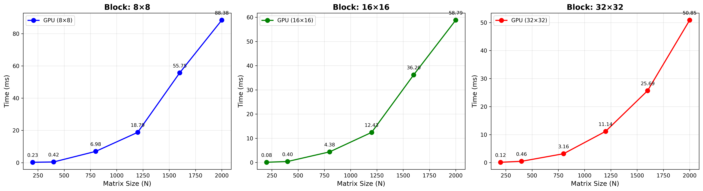

# Параллельное программирование  
## Лабораторная работа №4
### Программа перемножения двух матриц с использованием технологии **CUDA**.

# 1. Задание

Модифицировать программу из лабораторной работы №1 для параллельной работы с использованием технологии **CUDA**.

Провести эксперименты с разными размерами матриц и различными конфигурациями сетки блоков  и с различными размерами матриц: 200, 400, 800, 1200, 1600, 2000

Для каждого эксперимента необходимо:

-измерить время выполнения программы на CPU и GPU;
-сравнить производительность CPU и GPU (вычислить ускорение - Speedup);
-сохранить результаты вычислений в файл;
-записать статистику времени выполнения;
-проанализировать полученные результаты.

---

# 2. Описание программы

Основная программа реализована на языке **C++** в файле: lab4_kernel.cu

Программа выполняет следующие этапы:
1.Генерация двух квадратных матриц размера N × N со случайными значениями (0-9).
2.Вычисление произведения матриц на CPU для получения эталонного результата и измерения времени выполнения.
3.Выделение памяти на GPU и копирование исходных матриц.
4.Параллельное умножение матриц на GPU с использованием CUDA Kernel.
5.Измерение времени выполнения ядра с помощью CUDA Events.
6.Копирование результирующей матрицы с GPU на CPU.
7.Сравнение результатов CPU и GPU для проверки корректности.
8.Вычисление ускорения (Speedup = CPU_Time / GPU_Time).
9.Сохранение статистики времени выполнения в файлы: results_XxX.csv

Параллелизация на GPU реализована с использованием функций CUDA:

cudaMalloc / cudaFree — выделение и освобождение памяти на устройстве.

cudaMemcpy — копирование данных между хостом и устройством.

cudaEventCreate / cudaEventRecord / cudaEventElapsedTime — точное измерение времени выполнения ядра.

cudaEventSynchronize — синхронизация хоста с устройством.

matrix_mul_kernel<<<grid, block>>> — запуск ядра умножения матриц.

Каждый поток GPU вычисляет один элемент результирующей матрицы. Ядро организовано с использованием двумерной конфигурации блоков и сетки.

# 3. Результаты экспериментов

В ходе экспериментов была измерена скорость умножения квадратных матриц различных размеров с использованием технологии CUDA на GPU и последовательного алгоритма на CPU.

Эксперименты проводились для следующих размеров матриц:

200, 400, 800, 1200, 1600, 2000

Конфигурации блоков (threads per block):

(8,8), (16,16), (32,32)

Измерялось время выполнения операции умножения матриц в миллисекундах и вычислялось ускорение (Speedup).

---

## Таблица результатов для конфигурации (8,8)

|    N | CPU Time (ms) | GPU Time (ms) | Speedup   |
|-----:|--------------:|--------------:|----------:|
|  200 |         21.71 |        117.44 |    0.18x  |
|  400 |        199.61 |          0.65 |  308.07x  |
|  800 |       2395.66 |          6.98 |  343.33x  |
| 1200 |       6960.05 |         18.80 |  370.30x  |
| 1600 |      25411.20 |         55.76 |  455.74x  |
| 2000 |      60290.96 |         88.38 |  682.16x  |

## Таблица результатов для конфигурации (16,16)

|    N | CPU Time (ms) | GPU Time (ms) | Speedup   |
|-----:|--------------:|--------------:|----------:|
|  200 |      21.802   |      0.083616 |  260.74x  |
|  400 |     189.474   |      0.398464 |  475.51x  |
|  800 |    1889.13    |      4.38026  |  431.28x  |
| 1200 |    7963.44    |     12.4332   |  640.50x  |
| 1600 |   30822.7     |     36.1975   |  851.52x  |
| 2000 |   73860.9     |     58.7899   | 1256.35x  |

## Таблица результатов для конфигурации (32,32)

|    N | CPU Time (ms) | GPU Time (ms) | Speedup   |
|-----:|--------------:|--------------:|----------:|
|  200 |      22.906   |      0.115648 |  198.07x  |
|  400 |     201.513   |      0.458208 |  439.79x  |
|  800 |    1984.33    |      3.16246  |  627.47x  |
| 1200 |    8305.43    |     11.1448   |  745.23x  |
| 1600 |   32181.5     |     25.6855   | 1252.91x  |
| 2000 |   71882.6     |     50.8548   | 1413.49x  |

---

## График зависимости времени выполнения

Ниже представлены графики зависимости времени выполнения умножения матриц от размера матрицы для различных конфигураций блоков CUDA.

Рисунок – Зависимость времени выполнения умножения матриц от размера матрицы для конфигураций блоков (8×8), (16×16) и (32×32).

---

# 4. Вывод

В ходе лабораторной работы была реализована программа параллельного умножения матриц с использованием технологии **CUDA** на графическом процессоре (GPU).

Были проведены эксперименты с различными размерами матриц и конфигурациями блоков CUDA. Полученные результаты показали, что использование GPU позволяет значительно сократить время выполнения программы для матриц большого размера. Ускорение (Speedup) достигает **1413x** для матриц размером 2000×2000. Однако для малых матриц (N=200) накладные расходы на передачу данных и запуск ядра превышают выигрыш от параллелизма, что делает использование GPU неэффективным. Эффективность GPU возрастает с увеличением размера матриц, что подтверждает целесообразность применения технологии CUDA для вычислительно-интенсивных задач.